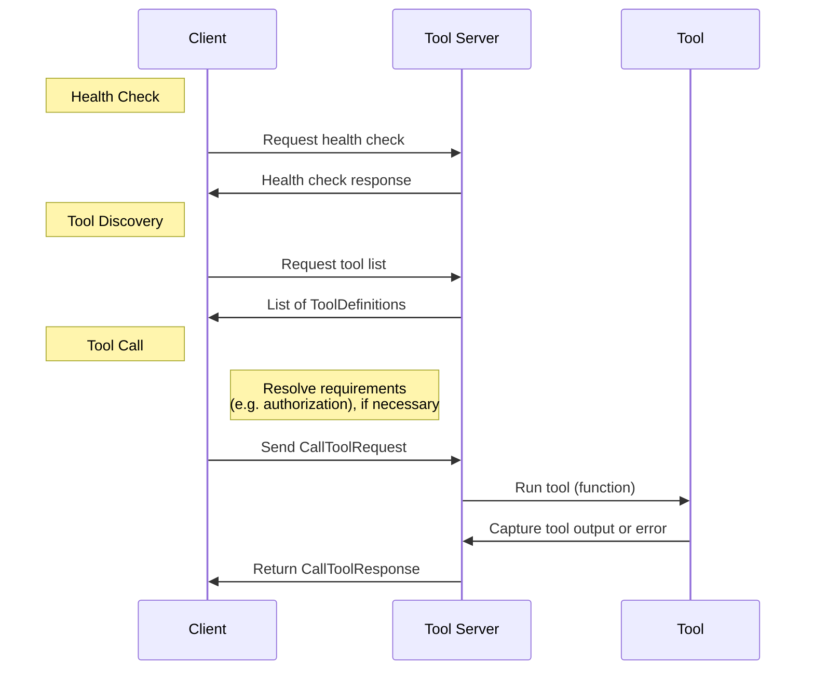

# Architecture

The Open eXecution Protocol is designed around three foundational communication flows:

1. **Health Check**: A mechanism to verify the availability and readiness of the Tool Server.
2. **Tool Discovery**: A process to enumerate the tools available on the Tool Server, described by the Tool Definition schema.
3. **Tool Call**: A structured request to execute a specific tool with defined input parameters. The client sends a Tool Request to the Tool Server, which executes the tool and returns a Tool Response.

These flows use the following schemas:

1. **Tool Definition**: A schema that specifies how a tool is described. It includes metadata such as the tool's name, unique identifier, and its input/output specifications.
2. **Tool Request**: A schema that details the structure of a tool call. It encompasses the call identifier, execution context, tool metadata, and input parameters.
3. **Tool Response**: A schema that outlines the structure of the response returned from a tool call. It provides details on execution status, duration, and the actual output (or errors) of the tool call.

These components ensure consistent communication between clients and tools, regardless of the implementation details of each tool.

