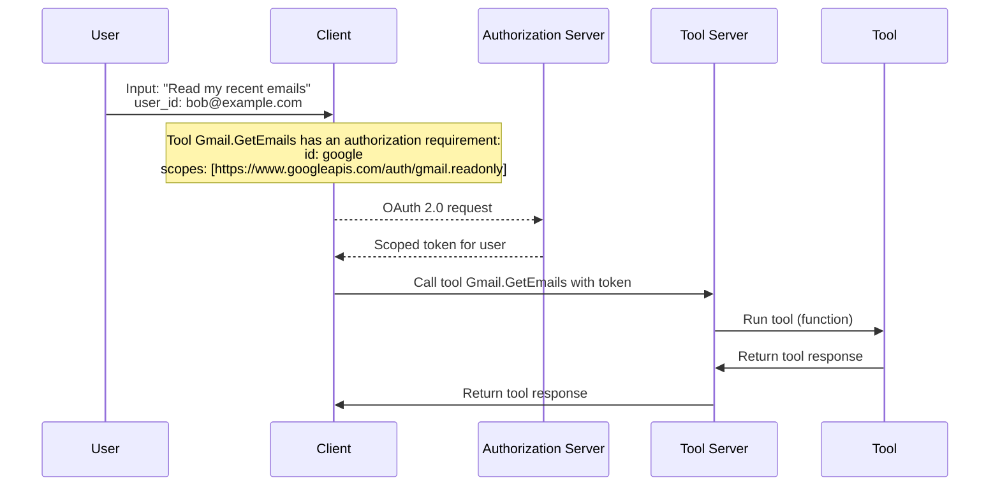

# Tool Authorization

Tool authorization describes how the server authorizes the tool call: given a tool's definition, whether the client needs to authorize the user before calling the tool.

Tools MAY require token-based or other forms of authorization, as specified in the `requirements.authorization` field of the [Tool Definition schema](../schemas/tool-definition).

If the `requirements` field is NOT present, the server MUST allow the tool to be executed without passing any additional information.

When a given tool describes authorization requirements in the `requirements.authorization` field, the client MUST resolve (or delegate to a trusted intermediary) the authorization requirements and provide the necessary credentials (e.g. a token) in the [Call Tool Request](../schemas/call-tool-request), before calling the tool.

If the client does not provide a valid token in the Call Tool Request for a tool that requires authorization, the server MUST return a 400 Bad Request response as described in the [Call Tool (Server Errors)](../protocol/call-tool#server-errors) section.

### Non-Normative Example: Tool Authorization Flow

