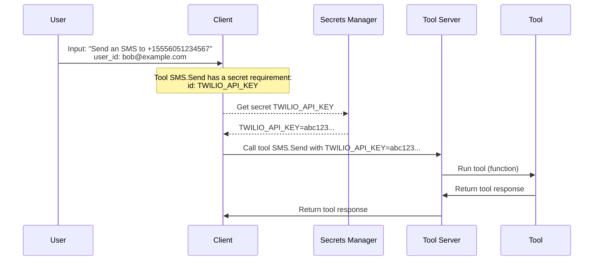

# Tool Secrets

Tool secrets are sensitive values that are required to call a tool, such as API keys, passwords, and other credentials.

Tools MAY require secrets, as specified in the `requirements.secrets` field of the Tool Definition schema.

When a tool requires secrets, the client MUST retrieve the secrets (itself or via a trusted intermediary) and provide them in the [Call Tool Request](../schemas/call-tool-request), before calling the tool.

If the client does not provide a secret in the Call Tool Request for a tool that requires a secret, the server MUST return a 400 Bad Request response as described in the [Call Tool (Server Errors)](../protocol/call-tool#server-errors) section.

### Non-Normative Example: Tool Secrets Management Flow

