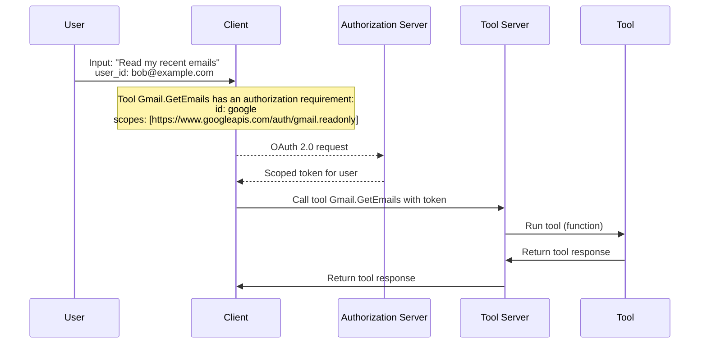
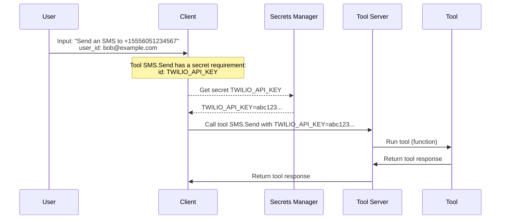

# Security and Authorization

Security is a critical component of the Open Tool Calling standard.

## Tool Authorization

Tool authorization describes how the server authorizes the tool call: given a tool's definition, whether the client needs to authorize the user before calling the tool.

Tools MAY require token-based or other forms of authorization, as specified in the `requirements.authorization` field of the Tool Definition schema.

When a given tool describes authorization requirements in the `requirements.authorization` field, the client MUST resolve (or delegate to a trusted intermediary) the authorization requirements and provide the necessary credentials (e.g. a token) in the Tool Call Request, before calling the tool.

If the client does not provide a valid token in the Tool Call Request for a tool that requires authorization, the server MUST return a 400 Bad Request response as described in the Tool Execution (Server Errors) section.

### Non-Normative Example: Tool Authorization Flow

### Tool Secrets Management

Tool secrets are sensitive information that is required to call a tool, such as API keys, passwords, and other credentials.

Tools MAY require secrets, as specified in the `requirements.secrets` field of the Tool Definition schema.

When a tool requires secrets, the client MUST retrieve the secrets (itself or via a trusted intermediary) and provide them in the Tool Call Request, before calling the tool.

If the client does not provide a secret in the Tool Call Request for a tool that requires a secret, the server MUST return a 400 Bad Request response as described in the Tool Execution (Server Errors) section.

### Non-Normative Example: Tool Secrets Management Flow

